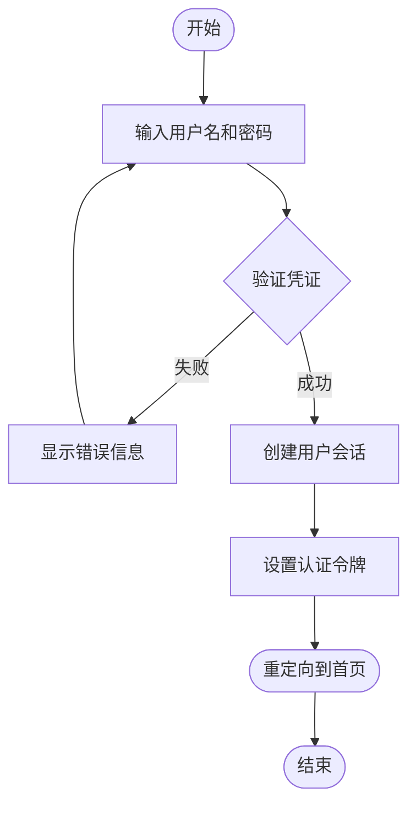

# Flowchart Generator

## 概述

这个 skill 提供了一个标准化的流程图生成工作流，确保在生成实际图表前先与用户确认设计思路。

## 工作流程

### 步骤 1: 分析需求

明确用户需要创建的流程图类型和内容：
- 流程图类型：业务流程、系统架构、工作流程、数据流、决策流程等
- 涉及的主要组件和步骤
- 特殊需求（如中文文本、特定样式等）

### 步骤 2: 生成文本流程图预览

使用基于文本的格式（ASCII 或 Markdown 表格）生成流程图的草稿，包含：
- 所有关键节点和步骤
- 节点之间的连接关系
- 分支和决策点
- 中文描述和标签

文本流程图示例格式：

```
开始
  ↓
[输入用户名和密码]
  ↓
{验证凭证}
  ├─ 失败 → [显示错误信息] → 返回输入
  └─ 成功 → [创建会话] → [重定向到首页]
                 ↓
               结束
```

或者使用 Markdown 格式：

```markdown
1. 用户打开登录页面
2. 输入用户名和密码
3. 点击登录按钮
4. 系统验证凭证
   - 如果失败：显示错误信息，返回步骤 2
   - 如果成功：
     5. 创建用户会话
     6. 设置认证令牌
     7. 重定向到首页
     8. 流程结束
```

### 步骤 3: 用户确认

使用 AskUserQuestion 工具询问用户：
- 流程图设计是否符合预期？
- 是否需要调整或添加节点？
- 是否可以继续生成 draw.io 图表？

如果用户选择修改，根据反馈调整文本流程图，然后再次确认。

### 步骤 4: 生成 Mermaid 代码

确认无误后，将文本流程图转换为 Mermaid 格式代码：



### 步骤 5: 调用 draw.io MCP 服务器

使用已配置的 draw.io MCP 服务器生成实际的流程图：
- 发送 Mermaid 代码或详细的流程描述
- MCP 服务器会在浏览器中显示生成的图表
- 图表可以保存为各种格式（SVG、PNG、PDF 等）

### 步骤 6: 后续支持

如果用户需要：
- 调整图表样式
- 添加更多细节
- 修改某个分支或节点
- 创建变体版本

根据需求重复上述步骤。

## 支持的流程图类型

- **业务流程图**：描述业务操作的步骤
- **系统架构图**：展示系统组件和关系
- **工作流程图**：团队或个人的工作步骤
- **数据流图**：展示数据在系统中的流动
- **决策流程图**：基于条件的分支决策
- **时序图**：展示组件之间的交互顺序
- **用户旅程图**：展示用户在产品中的路径
- **网络拓扑图**：展示网络设备连接关系

## 最佳实践

1. **清晰简洁**：每个节点只表达一个清晰的含义
2. **合理分层**：将复杂流程分解为多个层次
3. **一致命名**：使用统一的命名规范
4. **标注清晰**：对决策点和分支添加明确的条件说明
5. **适度复杂**：避免过于复杂的嵌套，必要时拆分为多个图表

## 常用 Mermaid 语法

- `graph TD`：从上到下的流程图
- `graph LR`：从左到右的流程图
- `NodeName([文字])`：圆角矩形（通常用于开始/结束）
- `NodeName[文字]`：矩形（通常用于处理步骤）
- `NodeName{文字}`：菱形（用于决策）
- `NodeName-->其他节点`：连接线
- `NodeName-->|条件|其他节点`：带标签的连接线
